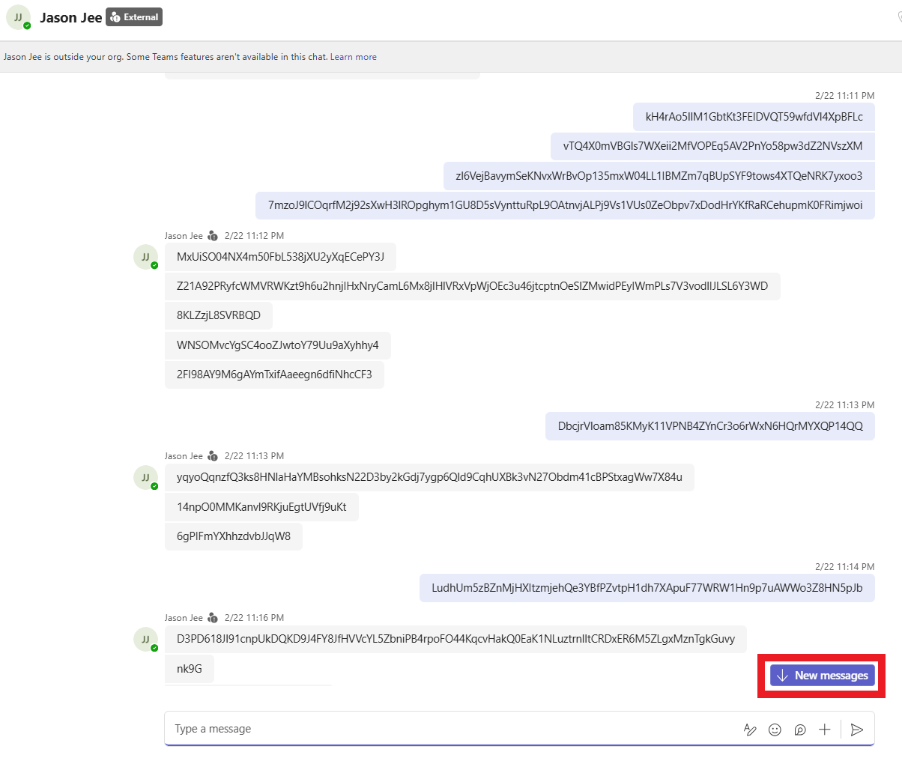
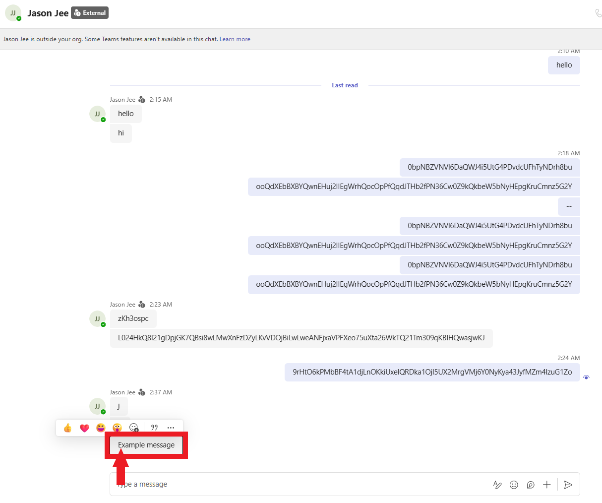
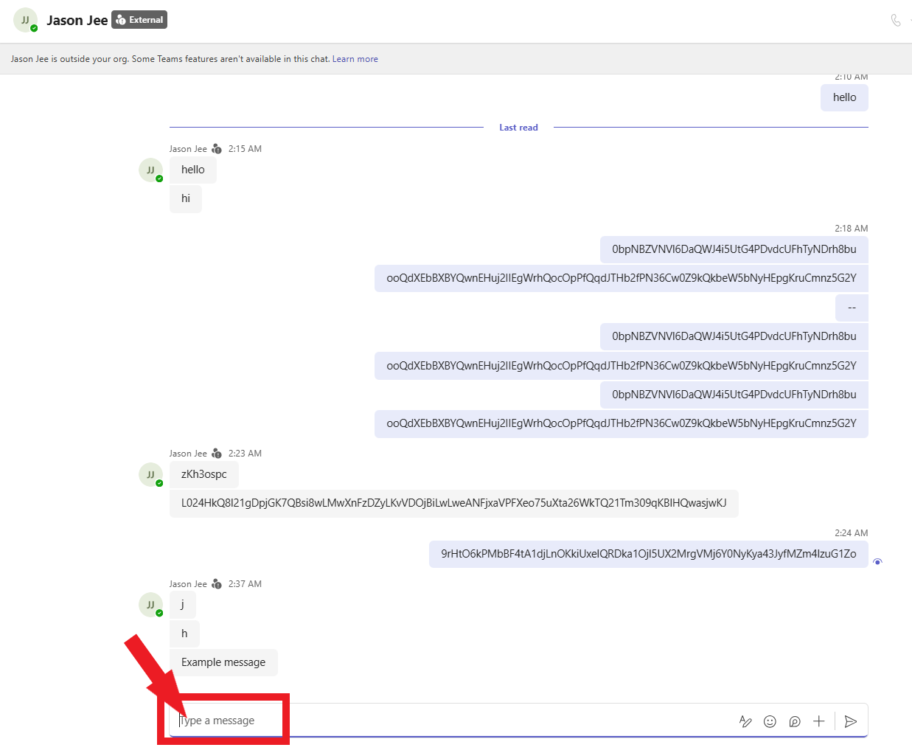

# Setup
- Run `pip install -r requirements.txt`.
- Make sure to have Microsoft Team's Chat settings as "Comfy" for the Message Density, and "Last read message" for "When I open a chat, take me to".
- To run this properly, you will need 2 Microsft Team's accounts, one logged into the VM that you are collecting data on, and one logged into your desktop/laptop.
- There should be 2 versions of the Team's scripts (one desktop and one remote). You should not need to touch the remote version of you are still running the script on the same configured VM (if the VM is different, then do the following steps for the VM as well). For the desktop version, you will need to find the coordinates for 3 locations. The New messages button, the latest message, and the chat box. Note: absolute coordinates were used because Team's appears differently on different devices, even with ratios applied.
    - First, run the find_coords.py, and open a conversation with someone on Team's. You will need to send enough messages so that you can scroll up and not see the latest message immediately when it is sent.
    - Then, on the VM Team's account, send a message. You should see the "New messages" button appear, as in the image below. Hover your mouse over it and note down the X and Y coordinates (respectively). This will be the values of BUTTON_PRESS_X_COORD and BUTTON_PRESS_Y_COORD respectively.
    
    - Then, scroll down, and make sure the latest message was sent by the VM user. Then, hover your mouse over it, where the arrow indicates in the image below, and note down the X and Y coordinates (respectively). This will be the values of COPY_X_COORD and COPY_Y_COORD respectively.
    
    - Then, hover your mouse over the text box, where the arrow indicates in the image below, and note down the X and Y coordinates (respectively). This will be the values of WRITE_X_COORD and WRITE_Y_COORD respectively.
    
- Now that you have all of these values, input them into their respective parameters in chatbot_desktop_version.py. The script should now be ready to run.
- PLEASE NOTE that when running the scripts, you MUST have the same version of parsed_conversation.txt. Therefore if you need to generate a new version of it (for a longer conversation for example), then you must make sure that it is the same on both the VM and your desktop/laptop.
- Once you are ready to run the scripts, you may begin running it in the order of: VM first, then desktop/laptop.
- This script automatically captures a Wireshark session using tshark, and disables NIC offloading, so you shouldn't need to worry about anything after the scripts begin running.
- You should begin seeing the messages being sent. You must leave this running until completion. It's recommended that you check up on it every so often to make sure that the messages are still being sent.
- Once the scripts are finished running and the conversation is fullyed played out, there should be a .pcapng file in the specified location.